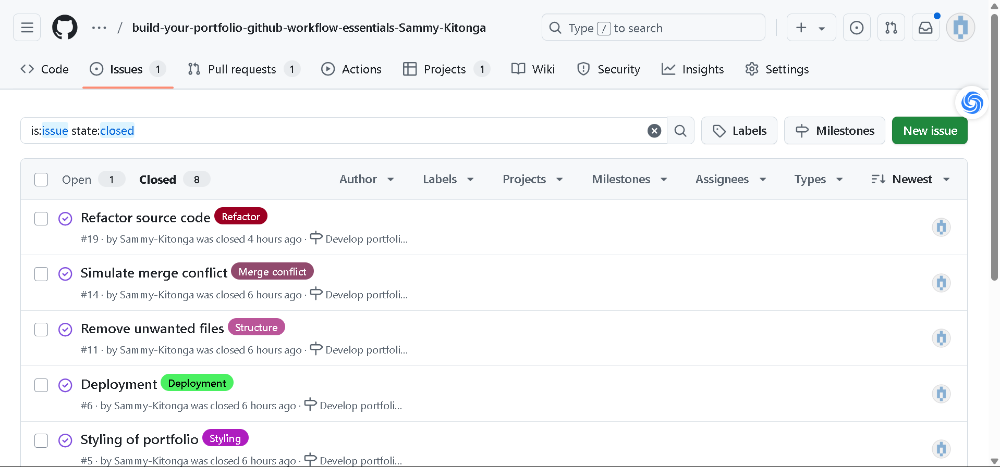

# Personal Portfolio Documentation

## 1. Student Details

- **Full Name**: Sammy Musangi Kitonga
- **GitHub Username**: Sammy-Kitonga
- **Email**: sammy.kitonga@strathmore.edu

## 2. Deployed Portfolio Link

- **GitHub Pages URL**:  
  https://is-project-4th-year.github.io/build-your-portfolio-github-workflow-essentials-Sammy-Kitonga/

## 3. Learnings from the Git Crash Program

List at least **four key concepts or skills** you learned during the Git crash course. For each one, write a brief explanation of how it helped you manage your portfolio project more effectively.

- **Merge Conflicts**: Taught me how to resolve merge conflicts in VS Code
- **Pull requests**: Helped me separate features and prevent conflicts when working on different sections of the site.
- **Project Board**: Allowed me to organize tasks, track progress, and prioritize work visually, making it easier to manage the development workflow.

- **Issues**: Helped me document bugs, feature requests, and tasks, making it simple to keep track of what needs to be done.

## 4. Screenshots of Key GitHub Features

Include screenshots that demonstrate how you used GitHub to manage your project. For each screenshot, write a short caption explaining what it shows.

> Upload the screenshots to your GitHub repository and reference them here using Markdown image syntax:
> (you could just simply copy and paste the image into the Assignment.md)

### A. Milestones and Issues

- Screenshot showing your milestone(s) and the issues linked to it.

### B. Project Board

- Screenshot of your GitHub Project Board with issues organized into columns (e.g., To Do, In Progress, Done).

### C. Branching

- Screenshot showing your branch list with meaningful naming.

### D. Pull Requests

- Screenshot of a pull request that’s either open or merged and linked to a related issue.

- Below is a Pull request linked to issue #19

### E. Merge Conflict Resolution

- Screenshot of a resolved merge conflict (in a pull request, commit history, or your local terminal/GitHub Desktop).

